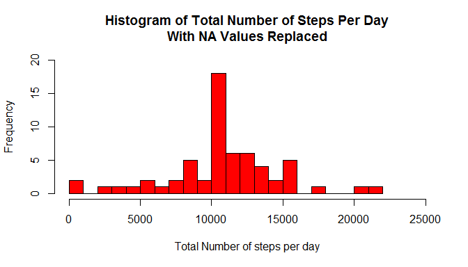

# Reproducible Research: Peer Assessment 1


## Set required library

```r
library(dplyr)
library(ggplot2)
```

## Loading and preprocessing the data
The data is loaded into a dataframe called "data".

```r
setwd("C:\\Rassignment\\Cse5Project1")
data <- read.csv("activity.csv",header = TRUE,stringsAsFactor=FALSE)
```

## What is mean total number of steps taken per day?

```r
library(dplyr)
nonNaData <- filter(data,!is.na(steps))
byDate <- group_by(nonNaData,date)
result1 <- summarise(byDate,sumsteps=sum(steps))
hist(result1$sumsteps,breaks = 20,col="red",ylim=c(0,12),xlim=c(0,25000), xlab="Total Number of steps per day", main="Histogram of Total Number of Steps Per Day")
```

 

- The mean and median is calculated as follow:

```r
meanStep <- as.character(round(mean(result1$sumsteps),2))
medianStep <- median(result1$sumsteps)
```
The mean total number of steps per day is 10766.19 and the median is 10765.

## What is the average daily activity pattern?


```r
byInterval <- group_by(nonNaData,interval)
result2 <- summarise(byInterval,avgsteps = mean(steps))
plot(x=result2$interval,y=result2$avgsteps,type="l",xlab="5 Minute Interval",ylab="Average Number Of Steps", main="Average Daily Activity Pattern")
```

 

- Calculation to identify 5-min interval with highest average steps is:

```r
maxStep <- result2$interval[which(result2$avgsteps==max(result2$avgsteps))]
```
The 5-min interval with highest average steps across all the days is 835.

## Imputing missing values

- Function to replace NA values in the data using mean step for each 5-min interval: 

```r
replaceNaStepsByInterval <- function(argData){   
    dataWithNa <- argData[is.na(argData$steps),]
    dataWithoutNa <- argData[!is.na(argData$steps),]
    grpByDate <- group_by(dataWithoutNa,interval)
    avgStepsPerInterval <- summarise(grpByDate,meanstep=mean(steps))
    y = nrow(avgStepsPerInterval)
    result=data.frame()
    for(i in 1:y){
        interval <- avgStepsPerInterval$interval[i]
        meanStep <- avgStepsPerInterval$meanstep[i]
        dataWithNa$steps[dataWithNa$interval==interval]=meanStep
    }
    result <- rbind(dataWithoutNa,dataWithNa)
    return(result)
}
```

- Replace NA values in the original data

```r
completeData <- replaceNaStepsByInterval(data)
```

- Plot histogram of the total number of steps taken each day after missing values were imputed:

```r
dataByDay <- group_by(completeData,date)
result4 <- summarise(dataByDay,sumsteps=sum(steps))
hist(result4$sumsteps,breaks = 20,col="red",ylim=c(0,20), xlab="Total Number of steps per day", main="Histogram of Total Number of Steps Per Day\nWith NA Values Replaced")
```

 

- The mean and median are calculated as follow:

```r
mean(result4$sumsteps)
```

```
## [1] 10766.19
```

```r
median(result4$sumsteps)
```

```
## [1] 10766.19
```

## Are there differences in activity patterns between weekdays and weekends?
- Function to calculate if the date falls on a weekday or weekend:

```r
dayOfWeekFunc <- function(arg){
    day <- weekdays(as.POSIXct(arg,format="%Y-%m-%d"))
    if(day == "Saturday" || day == "Sunday")
        return("weekend")
    else
        return("weekday")
}
```

- Panel plot comparing the average number of steps taken per 5-minute interval across weekdays and weekends:


```r
colDayInd <- sapply(completeData$date,dayOfWeekFunc)
View(colDayInd)
result5<-cbind(completeData,DayIndicator=colDayInd)
grpByInterval <- group_by(result5,interval,DayIndicator)
resultPlot <- summarise(grpByInterval,averagestep = mean(steps))
qplot(interval,averagestep,data=resultPlot,facets=DayIndicator~.,geom="line",xlab="5-min Interval",ylab="Average Number Of Steps")
```

 
